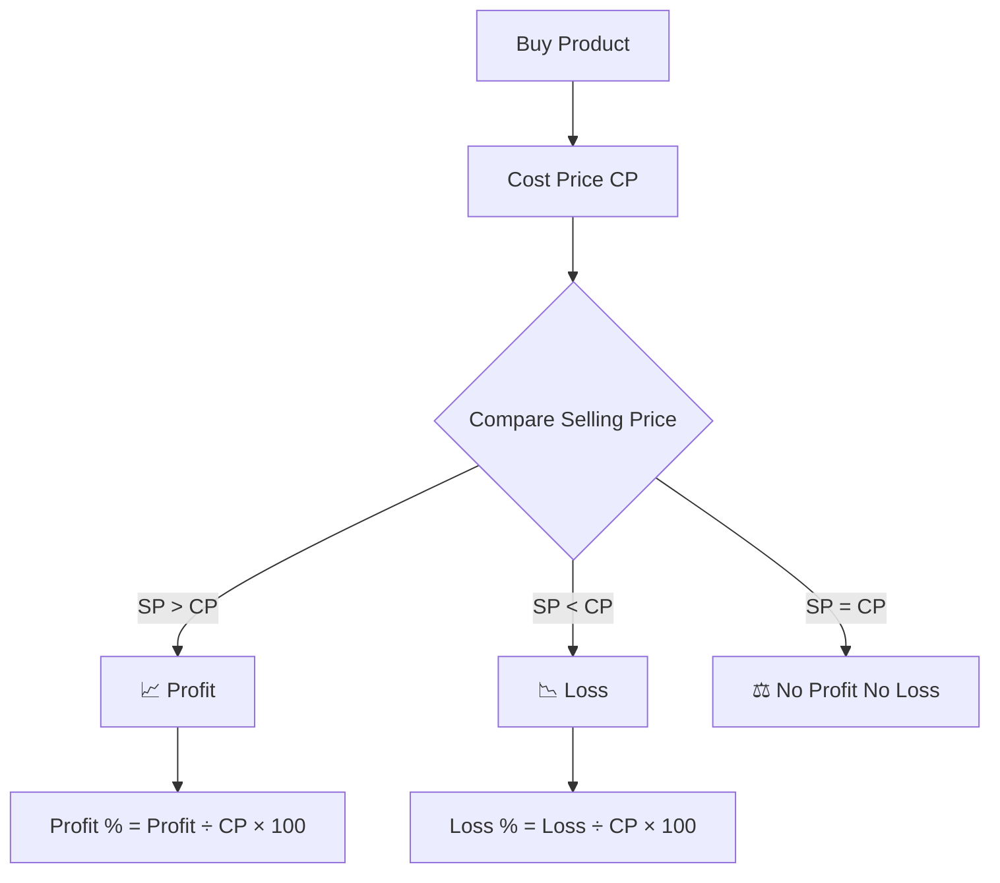

# 💰 Profit and Loss – The Ultimate Guide for Placements & Competitive Exams

<div align="center">

# 💵 Master Profit & Loss Like a Pro

### 📚 Part of the **Tech-Blog** Learning Series

*Learn • Practice • Crack Placements 🚀*


</div>

---

# 📌 Topic Information

| Information            | Details                                                             |
| ---------------------- | ------------------------------------------------------------------- |
| 📂 Repository          | **Tech-Blog**                                                       |
| 📁 Folder              | **Aptitude-preparation**                                            |
| 📖 Category            | Quantitative Aptitude                                               |
| ⏱️ Reading Time        | 25–30 Minutes                                                       |
| 🎯 Difficulty          | ⭐⭐ Beginner                                                         |
| 🔥 Placement Weightage | ⭐⭐⭐⭐⭐                                                               |
| 🏢 Frequently Asked In | TCS, Infosys, Wipro, Accenture, Cognizant, Capgemini, Deloitte      |
| 📝 Practice Questions  | 20+                                                                 |
| 💡 Shortcut Tricks     | Included                                                            |
| 🎓 Best For            | College Students, Placement Aspirants, Competitive Exam Preparation |

---

# 📑 Table of Contents

* Introduction
* What is Profit?
* What is Loss?
* Cost Price (CP)
* Selling Price (SP)
* Profit Formula
* Loss Formula
* Profit Percentage
* Loss Percentage
* Important Formula Sheet
* Real-Life Examples
* Solved Examples
* Shortcut Tricks
* Practice Questions
* Interview Tips
* Common Mistakes
* Summary
* Related Articles

---

# 📖 Introduction

Profit and Loss is one of the most fundamental and frequently asked topics in Quantitative Aptitude. It is commonly seen in campus placement tests, banking exams, SSC, railway exams, and many competitive examinations.

Apart from exams, Profit and Loss is also useful in everyday life. Whether you are shopping online, running a business, comparing discounts, or calculating margins, these concepts help you make better financial decisions.

Understanding this topic will also make advanced chapters such as **Discount**, **Simple Interest**, **Compound Interest**, and **Data Interpretation** much easier.

---

# 🎯 Learning Objectives

By the end of this guide, you will be able to:

* Understand Cost Price and Selling Price.
* Calculate Profit and Loss accurately.
* Solve percentage-based questions quickly.
* Apply shortcut techniques in exams.
* Avoid common mistakes.
* Build confidence for placement aptitude tests.

---

# 💡 What is Cost Price (CP)?

**Cost Price (CP)** is the amount paid to purchase an item.

### Example

If you buy a laptop for **₹50,000**, then:

* Cost Price = **₹50,000**

---

# 💰 What is Selling Price (SP)?

**Selling Price (SP)** is the amount at which the item is sold.

### Example

If you sell the same laptop for **₹55,000**, then:

* Selling Price = **₹55,000**

---

# 📈 What is Profit?

A **Profit** occurs when the Selling Price is greater than the Cost Price.

### Formula

```text
Profit = Selling Price − Cost Price
```

### Example

Cost Price = ₹500

Selling Price = ₹650

Profit = ₹650 − ₹500 = **₹150**

---

# 📉 What is Loss?

A **Loss** occurs when the Selling Price is less than the Cost Price.

### Formula

```text
Loss = Cost Price − Selling Price
```

### Example

Cost Price = ₹900

Selling Price = ₹750

Loss = ₹900 − ₹750 = **₹150**

---

# 📊 Profit Percentage Formula

```text
Profit % = (Profit ÷ Cost Price) × 100
```

### Example

CP = ₹1000

SP = ₹1200

Profit = ₹200

Profit %

= (200 ÷ 1000) × 100

= **20%**

---

# 📊 Loss Percentage Formula

```text
Loss % = (Loss ÷ Cost Price) × 100
```

### Example

CP = ₹800

SP = ₹600

Loss = ₹200

Loss %

= (200 ÷ 800) × 100

= **25%**

---

# 📝 Complete Formula Sheet

| Formula       | Expression          |
| ------------- | ------------------- |
| Profit        | SP − CP             |
| Loss          | CP − SP             |
| Profit %      | (Profit ÷ CP) × 100 |
| Loss %        | (Loss ÷ CP) × 100   |
| Selling Price | CP + Profit         |
| Selling Price | CP − Loss           |
| Cost Price    | SP − Profit         |
| Cost Price    | SP + Loss           |

---

# 🌍 Real-Life Applications

Profit and Loss concepts are used in:

* 🛒 Shopping
* 🏪 Retail Stores
* 🏢 Businesses
* 📈 Stock Trading (basic understanding)
* 💰 Budget Planning
* 📊 Financial Analysis
* 🛍️ E-commerce Platforms
* 💼 Entrepreneurship

Understanding these concepts helps you make informed purchasing and business decisions.

---

# 💡 Quick Memory Tips

* **SP > CP → Profit**
* **SP < CP → Loss**
* **Profit and Loss percentages are always calculated on Cost Price (CP).**
* Always identify CP and SP before applying any formula.

---

# 📌 Key Takeaways (So Far)

* Cost Price = Purchase Price
* Selling Price = Selling Amount
* Profit occurs when SP > CP
* Loss occurs when SP < CP
* Profit % and Loss % are based on Cost Price

---

## ⏭️ Coming in Part 2

In the next part, we'll cover:

* ⚡ Shortcut Tricks
* 🧮 Placement-Level Solved Examples
* 📊 Mermaid Flow Diagram
* ❌ Common Mistakes
* 💡 Pro Tips for Faster Calculations
* 🎯 Exam-Oriented Questions


## Part 2

---

# 🧠 Visual Understanding



> 💡 **Memory Trick:** Always compare the **Selling Price (SP)** with the **Cost Price (CP)** first. Once you know whether it is a profit or a loss, choosing the correct formula becomes much easier.

---

# ⚡ Shortcut Tricks for Placements

## 🚀 Trick 1: Remember the Golden Rule

```text
SP > CP  → Profit

SP < CP  → Loss

SP = CP  → No Profit No Loss
```

---

## 🚀 Trick 2: Profit Percentage

Instead of memorizing long formulas, remember:

```text
Profit %

↓

Profit

↓

Cost Price

↓

×100
```

Always divide by **Cost Price**.

---

## 🚀 Trick 3: Loss Percentage

Same rule applies.

```text
Loss

↓

Cost Price

↓

×100
```

Never divide by Selling Price.

---

## 🚀 Trick 4: Calculate 10% Mentally

Example:

10% of ₹850

= ₹85

Then,

20% = ₹170

5% = ₹42.5

15% = ₹127.5

This trick saves a lot of time during online aptitude tests.

---

## 🚀 Trick 5: Common Percentage Values

| Percentage | Fraction |
| ---------- | -------- |
| 10%        | 1/10     |
| 20%        | 1/5      |
| 25%        | 1/4      |
| 50%        | 1/2      |
| 75%        | 3/4      |

Memorizing these conversions makes calculations much faster.

---

# 📝 Solved Examples

## Example 1

A shopkeeper buys a mobile phone for **₹15,000** and sells it for **₹18,000**.

### Solution

Cost Price

= ₹15,000

Selling Price

= ₹18,000

Profit

= ₹18,000 − ₹15,000

= **₹3,000**

Profit %

= (3000 ÷ 15000) × 100

= **20%**

✅ **Answer: Profit = ₹3,000 (20%)**

---

## Example 2

A bicycle was purchased for **₹8,000** and sold for **₹7,200**.

### Solution

Loss

= ₹800

Loss %

= (800 ÷ 8000) × 100

= **10%**

✅ **Answer: Loss = ₹800 (10%)**

---

## Example 3

A laptop was bought for **₹50,000** and sold for **₹57,500**.

Profit

= ₹7,500

Profit %

= (7500 ÷ 50000) × 100

= **15%**

✅ **Answer: 15% Profit**

---

## Example 4

A television costs **₹24,000**.

The shopkeeper earns **25% profit**.

Find the Selling Price.

### Solution

Profit

= 25% of 24,000

= ₹6,000

Selling Price

= ₹24,000 + ₹6,000

= **₹30,000**

---

## Example 5

A product is sold for **₹1,350** after a loss of **10%**.

Find the Cost Price.

### Solution

Selling Price = 90% of Cost Price

CP = 1350 ÷ 0.90

= **₹1,500**

---

# 🎯 Placement-Oriented Tips

✔ Write **CP** and **SP** first before solving.

✔ Never calculate percentages on Selling Price unless the question explicitly asks.

✔ Simplify fractions whenever possible.

✔ Use mental calculations instead of long multiplication.

✔ Read the question carefully to identify whether it is asking for **amount** or **percentage**.

---

# ❌ Common Mistakes Students Make

### ❌ Mistake 1

Using Selling Price instead of Cost Price in percentage calculations.

✔ Correct Rule:

Profit % and Loss % are calculated on **Cost Price**.

---

### ❌ Mistake 2

Confusing Profit Amount with Profit Percentage.

Example:

Profit = ₹500

This does **not** mean Profit = 500%.

---

### ❌ Mistake 3

Ignoring the units.

Always keep the currency (₹) separate from percentages (%).

---

### ❌ Mistake 4

Using the wrong formula.

Before solving, ask yourself:

* Is it Profit?
* Is it Loss?
* Is the question asking for CP, SP, Profit, Loss, or Percentage?

---

# 🏆 Pro Tips

* Practice at least **10 Profit & Loss questions daily**.
* Memorize the core formulas.
* Revise percentage concepts before this chapter.
* Focus on accuracy first, then speed.
* Attempt previous placement papers to understand question patterns.

---

## ⏭️ Coming in Part 3

The next section includes:

* 🏢 Company-wise Questions (TCS, Infosys, Wipro, Accenture)
* 📝 20+ Practice Questions
* 🎯 MCQs with Answers
* 💼 Interview Tips
* 📚 Best Books
* 🌐 Practice Websites
* 🔗 Previous & Next Navigation
* 👨‍💻 LinkedIn & GitHub
* ⭐ Support This Repository
