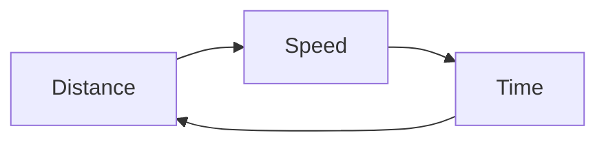

# 🚗 Time, Speed and Distance (TSD) – Complete Guide for Placements & Competitive Exams

<div align="center">

# ⚡ Master Time, Speed & Distance Like a Pro

### 📚 Part of the **Tech-Blog** Learning Series

*Learn • Practice • Crack Placements 🚀*


</div>

---

# 📌 Topic Information

| 📖 Information         | Details                                                        |
| ---------------------- | -------------------------------------------------------------- |
| 📂 Repository          | **Tech-Blog**                                                  |
| 📁 Folder              | **Aptitude-preparation**                                       |
| 📚 Category            | Quantitative Aptitude                                          |
| ⏱ Reading Time         | 30–35 Minutes                                                  |
| 🎯 Difficulty          | ⭐⭐⭐ Intermediate                                               |
| 🔥 Placement Weightage | ⭐⭐⭐⭐⭐                                                          |
| 🏢 Frequently Asked In | TCS, Infosys, Wipro, Accenture, Cognizant, Capgemini, Deloitte |
| 🎓 Suitable For        | Placement, Banking, SSC, CAT, Government Exams                 |
| 📝 Practice Questions  | 30+                                                            |
| 💡 Shortcut Tricks     | Included                                                       |

---

# 🌟 Why Learn Time, Speed and Distance?

Time, Speed and Distance (TSD) is one of the **most important aptitude topics** asked in placement tests and competitive examinations.

Questions from this topic are generally straightforward once you understand the relationship between the three variables:

* ⏱ Time
* 🚀 Speed
* 📏 Distance

A strong understanding of TSD also helps in solving advanced topics such as:

* 🚆 Trains
* 🚤 Boats & Streams
* 🚶 Relative Speed
* 🛣️ Circular Tracks
* 🚦 Race Problems

---

# 🎯 Learning Objectives

After completing this guide, you will be able to:

* ✅ Understand the relationship between Time, Speed, and Distance.
* ✅ Solve placement-level questions quickly.
* ✅ Convert different speed units.
* ✅ Use shortcut tricks to save time.
* ✅ Solve train and boat problems with confidence.

---

# 📑 Table of Contents

1. Introduction
2. Basic Concepts
3. Distance
4. Speed
5. Time
6. Core Formula
7. Unit Conversions
8. Real-Life Applications
9. Shortcut Tricks
10. Solved Examples
11. Practice Questions
12. Interview Tips
13. Resources
14. Summary

---

# 🌍 Real-Life Applications

The concepts of Time, Speed and Distance are used in everyday life:

* 🚗 Planning road trips
* 🚆 Train schedules
* ✈️ Flight timings
* 🚲 Cycling and marathons
* 📦 Delivery and logistics
* 🚚 Transportation management
* 🛰️ GPS navigation
* 🚕 Ride-sharing services

---

# 🤔 What is Time?

**Time** is the duration required to travel a certain distance at a given speed.

Example:

A car takes **2 hours** to travel from City A to City B.

Then,

**Time = 2 Hours**

---

# 🚀 What is Speed?

**Speed** tells us how fast an object moves.

It represents the distance covered in one unit of time.

Example:

A bike travels **60 km in one hour.**

Speed = **60 km/h**

---

# 📏 What is Distance?

Distance is the total length travelled from one place to another.

Example:

Lucknow to Kanpur

Distance = **80 km**

---

# ⭐ Golden Formula

```text
Distance = Speed × Time

Speed = Distance ÷ Time

Time = Distance ÷ Speed
```

---

# 🧠 Memory Triangle

```text
          Distance
         ───────────
        Speed × Time
```

💡 **Tip:** Cover the value you want to calculate.

* Cover **Distance** → Speed × Time
* Cover **Speed** → Distance ÷ Time
* Cover **Time** → Distance ÷ Speed

---

# 🔄 Unit Conversions

One of the most common mistakes in aptitude tests is using the wrong unit.

| Conversion | Formula |
| ---------- | ------- |
| km/h → m/s | × 5/18  |
| m/s → km/h | × 18/5  |

### Example

Convert **72 km/h** into **m/s**

```text
72 × 5 /18

=20 m/s
```

---

### Example

Convert **15 m/s** into **km/h**

```text
15 ×18 /5

=54 km/h
```

---

# 🧮 Important Formulas

| Formula       | Expression                  |
| ------------- | --------------------------- |
| Distance      | Speed × Time                |
| Speed         | Distance ÷ Time             |
| Time          | Distance ÷ Speed            |
| Average Speed | Total Distance ÷ Total Time |

---

# 📊 Visual Flow



---

# 💡 Quick Tips

✅ Always convert units first.

✅ Write the given values before solving.

✅ Check whether time is given in **hours** or **minutes**.

✅ Distance should always be in the same unit as speed.

---

# ⚠ Common Mistakes

❌ Forgetting to convert km/h into m/s.

❌ Mixing minutes and hours.

❌ Using different units in the same calculation.

❌ Applying the wrong formula.

---

# 📌 Key Takeaways

* Distance = Speed × Time
* Learn unit conversions by heart.
* Use the memory triangle for quick recall.
* Practice conversion questions regularly.
* Build strong fundamentals before attempting train or boat problems.

---

## ⏭️ Coming in Part 2

In the next section, you'll learn:

* 🚆 Train Problems
* 🚤 Boats & Streams
* 🏃 Relative Speed
* ⚡ Shortcut Tricks
* 📝 12+ Solved Examples
* 🎯 Placement Questions
* 💼 Company-wise Questions
* ❓Practice Set
* 🏆 Interview Tips


💡 Placement Challenge:
A train travels at 72 km/h. How much distance will it cover in 45 minutes?
(Try solving it before reading the solution in Part 2!)